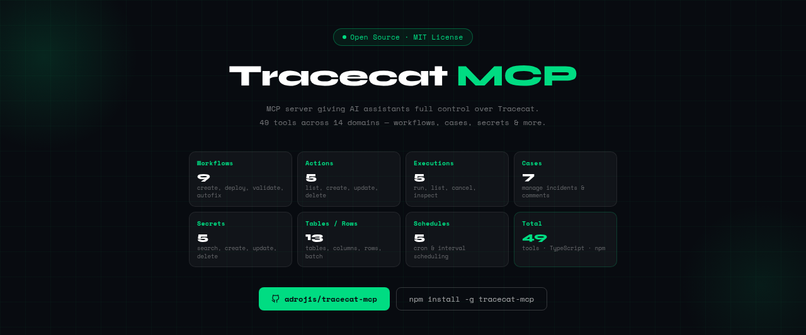

<p align="center">
  
</p>

# tracecat-mcp-community

**A full-stack Model Context Protocol (MCP) server for the [Tracecat](https://tracecat.com) SOAR platform — 94 tools across 16 domains.**

[](LICENSE)
[](https://www.npmjs.com/package/tracecat-mcp-community)
[](https://nodejs.org)
[](https://github.com/adrojis/tracecat-mcp-community/actions/workflows/ci.yml)
[](https://github.com/TracecatHQ/tracecat)
[](https://modelcontextprotocol.io)
[](#docker)

---

## What is this?

An [MCP server](https://modelcontextprotocol.io) that gives AI assistants (Claude Code, Claude Desktop, etc.) full control over a [Tracecat](https://github.com/TracecatHQ/tracecat) instance through natural language. Manage workflows, actions, cases, secrets, tables, schedules, graphs, and more — without leaving your editor.

- **94 tools** covering the full Tracecat API surface, including write operations not exposed by the official MCP
- **Stdio transport** — no OIDC/SSO setup required, works against any self-hosted Tracecat
- **Lazy authentication** — MCP transport starts instantly, login happens on first tool call
- **Auto workspace detection** — no manual workspace ID needed
- **Session cookie auth** — handles Tracecat's cookie-based auth transparently

---

## Community MCP vs Official MCP

Tracecat ships an [official MCP server](https://docs.tracecat.com/automations/tracecat-mcp) (HTTP transport, OIDC auth, bundled with the platform). This community MCP is a **standalone alternative** you can use instead — pick the one that fits your setup.

| | Community MCP (this project) | [Official MCP](https://docs.tracecat.com/automations/tracecat-mcp) |
|---|---|---|
| **Transport** | stdio (local) | HTTP (remote) |
| **Auth** | Session cookie (username/password) | OIDC / SSO |
| **Setup** | `npx tracecat-mcp-community` + `.env` | Requires OIDC configured on the Tracecat instance |
| **Tool coverage** | 94 tools — full CRUD + graph ops + autofix + variables/integrations | ~90 tools — read + basic CRUD, plus agents/skills (EE-oriented) |
| **Exclusive capabilities** | Graph editing (`add_edges`, `move_nodes`, `autofix_workflow`), Schedules CRUD, Secrets write, Cases CRUD + tasks + fields, Actions CRUD, Variables CRUD, Integrations management, Templates, Webhook key rotation | Agent presets/skills/sessions (Enterprise Edition), official support, platform-integrated |
| **Best for** | Local dev, self-hosted without SSO, workflow authoring/editing at scale | Teams already running Tracecat Cloud or self-hosted with OIDC |

You don't need both. This community MCP is designed to cover the full surface on its own.

---

## Tools

| Domain | Tools | Description |
|---|---|---|
| **Workflows** | 9 | List, create, get, update, deploy, export, delete, validate, autofix |
| **Actions** | 5 | List, create, get, update, delete workflow actions |
| **Executions** | 6 | Run workflows, run drafts, list/get/cancel executions, compact view |
| **Cases** | 15 | List, create, get, update, delete cases; comments; tasks CRUD; custom fields CRUD |
| **Secrets** | 5 | Search, create, get, update, delete secrets |
| **Variables** | 6 | List, search, get, create, update, delete non-sensitive workspace variables |
| **Tables** | 5 | List, create, get, update, delete tables |
| **Columns** | 2 | Create, delete table columns |
| **Rows** | 6 | List, get, insert, update, delete, batch insert rows |
| **Schedules** | 5 | List, create, get, update, delete schedules |
| **Graph** | 5 | Get graph, add/delete edges, move nodes, update trigger position |
| **Folders** | 5 | List, create, update, delete folders; move workflows into folders |
| **Workspaces** | 5 | Get current, list, create, update, delete workspaces |
| **Integrations** | 7 | List/get/test/disconnect/delete integrations; list/get OAuth providers |
| **Webhooks** | 3 | Get/update webhook, rotate API keys |
| **Docs** | 2 | Search Tracecat docs, list available tool documentation |
| **Templates** | 2 | List and get community workflow templates |
| **System** | 1 | Health check |

> **Total: 94 tools** for complete Tracecat automation.

---

## Quick Start

### Option A: npx (fastest)

```bash
# Install globally
npm install -g tracecat-mcp-community
```

Create a `.env` file wherever you run from (or in the package directory):

```env
TRACECAT_API_URL=http://localhost/api
TRACECAT_USERNAME=your-email@example.com
TRACECAT_PASSWORD=your-password-here
TRACECAT_WORKSPACE_ID=              # Optional — auto-detected if omitted
```

Add to your `.mcp.json`:

```json
{
  "mcpServers": {
    "tracecat": {
      "command": "npx",
      "args": ["-y", "tracecat-mcp-community"]
    }
  }
}
```

### Option B: From source

```bash
git clone https://github.com/adrojis/tracecat-mcp-community.git
cd tracecat-mcp-community
npm install
cp .env.example .env    # Edit with your credentials
npm run build
```

Add to your `.mcp.json`:

```json
{
  "mcpServers": {
    "tracecat": {
      "command": "node",
      "args": ["/absolute/path/to/tracecat-mcp-community/dist/index.js"]
    }
  }
}
```

### Option C: Docker

```bash
git clone https://github.com/adrojis/tracecat-mcp-community.git
cd tracecat-mcp-community
docker build -t tracecat-mcp-community .
```

```json
{
  "mcpServers": {
    "tracecat": {
      "command": "docker",
      "args": ["run", "-i", "--rm", "--env-file", "/path/to/.env", "tracecat-mcp-community"]
    }
  }
}
```

> **Security:** `.env` is gitignored and never committed. Never hardcode credentials in source files. See [SECURITY.md](SECURITY.md).

Then restart Claude Code and verify with `/mcp` — you should see the `tracecat` server with 94 tools.

---

## Configuration

| Variable | Required | Default | Description |
|---|---|---|---|
| `TRACECAT_API_URL` | No | `http://localhost/api` | Tracecat API base URL |
| `TRACECAT_USERNAME` | **Yes** | — | Login email |
| `TRACECAT_PASSWORD` | **Yes** | — | Login password |
| `TRACECAT_WORKSPACE_ID` | No | Auto-detected | Workspace ID (uses first workspace if omitted) |

Credentials are loaded from `.env` via [dotenv](https://github.com/motdotla/dotenv). The `.env` file must be in the project root (next to `package.json`).

---

## Architecture

```
src/
├── index.ts          # Entry point — StdioTransport + env loading
├── server.ts         # McpServer creation + tool registration
├── client.ts         # HTTP client with lazy auth + auto workspace injection
├── types.ts          # TypeScript interfaces
└── tools/
    ├── workflows.ts    # Workflow CRUD + deploy/export/validate/autofix
    ├── actions.ts      # Action CRUD with YAML inputs
    ├── cases.ts        # Case CRUD + comments + tasks + custom fields
    ├── executions.ts   # Run (live + draft), list, cancel, inspect executions
    ├── secrets.ts      # Secret management
    ├── variables.ts    # Non-sensitive workspace variables CRUD
    ├── tables.ts       # Tables, columns, and rows
    ├── graph.ts        # Graph operations (get graph, edges, node positions)
    ├── folders.ts      # Folder CRUD + move workflow into folder
    ├── workspaces.ts   # Workspace CRUD + current-workspace info
    ├── integrations.ts # OAuth integrations + providers
    ├── webhooks.ts     # Webhook get/update + key rotation
    ├── schedules.ts    # Cron/interval scheduling
    ├── docs.ts         # Documentation search
    ├── templates.ts    # Community workflow templates
    └── system.ts       # Health check
```

---

## Key Design Decisions

| Decision | Rationale |
|---|---|
| **Lazy initialization** | MCP transport starts immediately; login happens on first tool call. Avoids blocking Claude Code startup. |
| **Session cookies** | Tracecat currently uses `fastapiusersauth` cookies, not API keys. The client handles login and cookie extraction automatically. See note below on upcoming API token support. |
| **YAML string inputs** | Action `inputs` are sent as YAML strings per the Tracecat API contract, not JSON objects. |
| **POST for updates** | Actions, secrets, and schedules use `POST` for updates instead of the conventional `PATCH`. |
| **Auto workspace injection** | `workspace_id` is auto-detected and injected as a query parameter on every request. |
| **Optimistic locking** | Graph operations read `base_version` before patching to prevent concurrent edit conflicts. |

---

## Authentication Roadmap

This server currently authenticates via **username/password** (session cookies). The Tracecat team is actively working on **API token authentication**, which will provide a simpler and more secure connection method — no more password in `.env`.

We will add API token support as soon as it becomes available upstream. The username/password method will remain supported for backward compatibility.

---

## API Quirks

These behaviors differ from typical REST conventions and are handled transparently by the server:

| Quirk | Details |
|---|---|
| `workspace_id` as query param | Must be `?workspace_id=...`, not a header |
| POST for updates | `/actions/{id}`, `/secrets/{id}`, `/schedules/{id}` use POST |
| Actions list endpoint | `GET /actions?workflow_id=...` (not nested under `/workflows`) |
| Action inputs format | YAML string, not JSON object |
| Workflow list pagination | Returns `{ items: [...], next_cursor }`, not a plain array |

---

## Development

```bash
# Watch mode (auto-reload)
npm run dev

# Build TypeScript
npm run build

# Run directly
node dist/index.js
```

## Testing

```bash
npm run build
npm test
```

Tests use Node.js built-in test runner (no extra dependencies). See [CONTRIBUTING.md](CONTRIBUTING.md) for guidelines.

## MCP Inspector

The [MCP Inspector](https://github.com/modelcontextprotocol/inspector) is a visual debugging tool that lets you browse and test all 94 tools interactively in your browser — useful for verifying your setup, exploring tool schemas, and testing API calls without Claude.

From the project root:

```bash
npx @modelcontextprotocol/inspector node dist/index.js
```

This starts a local web UI (default: `http://localhost:6274`). Click the **Tools** tab to see all available tools, inspect their input schemas, and execute them against your Tracecat instance.

---

## Roadmap

This project is under active development. Tracecat's API surface evolves fast, and we intend to keep up — expect new tools, refinements, and breaking-change adaptations as the platform matures.

Planned areas of improvement:

- **More tools** — covering new Tracecat API endpoints as they ship
- **Better error handling** — structured error responses with actionable hints
- **OAuth/OIDC support** — for Tracecat instances using SSO instead of basic auth
- **Test suite** — automated integration tests against a live Tracecat instance

Contributions, issues, and feature requests are welcome.

---

## Related Projects

- [Tracecat official MCP](https://docs.tracecat.com/automations/tracecat-mcp) — HTTP/OIDC MCP bundled with the platform (alternative to this one)
- [tracecat-skills](https://github.com/adrojis/tracecat-skills) — Claude Code skills for Tracecat workflow building
- [Tracecat](https://github.com/TracecatHQ/tracecat) — The open-source SOAR platform
- [MCP SDK](https://github.com/modelcontextprotocol/typescript-sdk) — Model Context Protocol TypeScript SDK

> **Note:** This project was previously named `tracecat-mcp`. It was renamed to `tracecat-mcp-community` in April 2026 to distinguish it from Tracecat's official MCP server (HTTP + OIDC), which shipped shortly after.

---

## License

[MIT](LICENSE)
